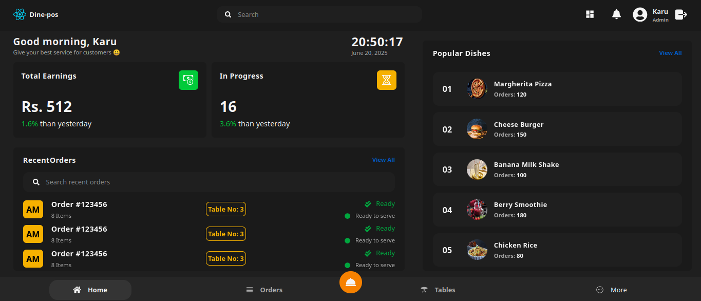
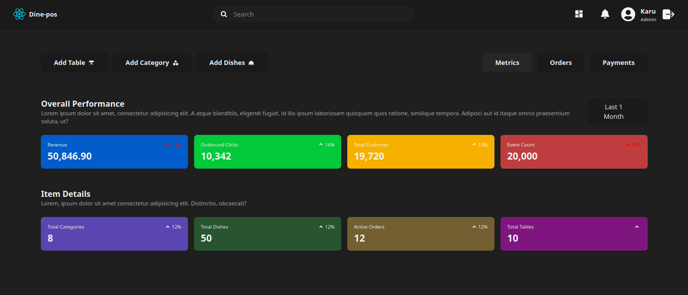
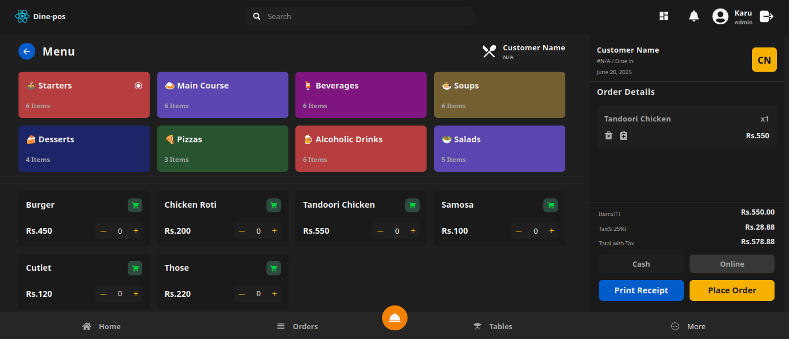
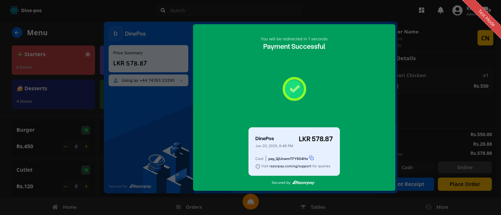

# 🍽️ Smart Dine POS - Restaurant Management System


A modern restaurant POS system with Spring Boot backend and React frontend, featuring integrated payment processing via Razorpay.






---

## ✨ Features

### 🧾 Frontend (React)
- Table management with drag-and-drop
- Real-time order tracking
- Bill splitting and payment processing
- Responsive design for all devices

### ⚙️ Backend (Spring Boot)
- JWT authentication
- Razorpay payment integration
- Webhook verification
- MongoDB data persistence
- Ngrok tunneling for development

### 🔐 Admin Features
- Menu CRUD operations
- Staff role management
- Sales analytics dashboard
- Inventory monitoring

---

## 🛠️ Tech Stack

| Component         | Technology                          |
|-------------------|-------------------------------------|
| **Frontend**      | React 18 + Tailwind CSS             |
| **Backend**       | Spring Boot 3.2                     |
| **Database**      | MongoDB Atlas                       |
| **Payment**       | Razorpay API                        |
| **Auth**          | JWT + Spring Security               |
| **Dev Tools**     | Ngrok, Postman                      |
| **Deployment**    | AWS EC2 (Backend), Vercel (Frontend)|

---

## 🔌 System Architecture

```bash
smart-dine-pos/
├── frontend/ # React Application
│ ├── public/
│ └── src/
│ ├── components/
│ ├── pages/
│ └── services/ # API Service Layer
│
├── backend/ # Spring Boot Application
│ ├── src/main/java/
│ │ ├── config/ # Security & Razorpay config
│ │ ├── controller/ # API Controllers
│ │ ├── dto/ # Data Transfer Objects
│ │ ├── model/ # MongoDB Entities
│ │ ├── repository/ # Spring Data Repositories
│ │ └── service/ # Business Logic
│ └── resources/
│ ├── application.yml
│ └── razorpay.yml
│
├── ngrok/ # Tunneling Configuration
└── README.md
```

---

## 🔐 Security Implementation

- **JWT Authentication** with Spring Security
- **Razorpay Webhook Verification** using HMAC-SHA256
- **Environment-based** configuration
- **Rate limiting** on sensitive endpoints
- **CSRF protection** for web forms


## 🚨 Key Challenges Solved

### ✅ Real-time Order Sync
Built using React Context and MongoDB updates to ensure table orders sync across devices.

### ✅ Role-based Access
Middleware enforces admin/waiter/cashier permissions for secure route protection.

### ✅ Inventory Auto-Decrement
Ingredient stock updates dynamically as dishes are sold.

---

## 🌟 Upcoming Features

- [ ] Kitchen Display System (KDS) UI
- [ ] Multi-branch restaurant support
- [ ] Printer integration (POS printers)
- [ ] Offline Mode with IndexedDB (PWA support)

---

## 💻 Local Setup

```bash
# Clone the repo
git clone https://github.com/Milinda55/smart-dine-pos.git
cd resto-pos-mern

# Backend Setup
cd pos-backend
npm install
npm run dev

# Frontend Setup
cd ../pos-frontend
npm install
npm start
```

## 📃 License

This project is licensed under the **MIT License** – see the [LICENSE](LICENSE.txt) file for details.


## 🙏 Acknowledgments

- Thanks to open-source contributors and online communities for libraries, icons, and resources.
- Inspired by the love for cooking and the desire to share amazing recipes with others.